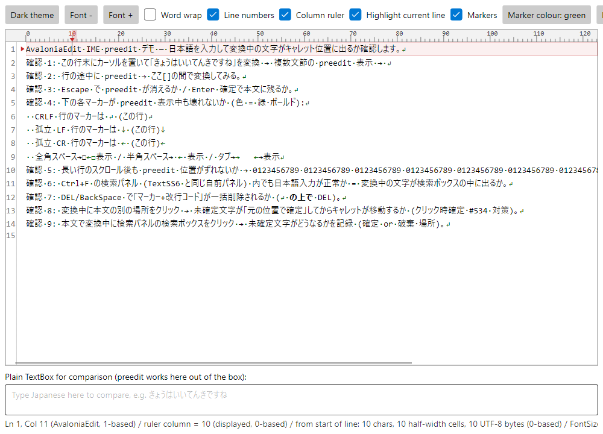
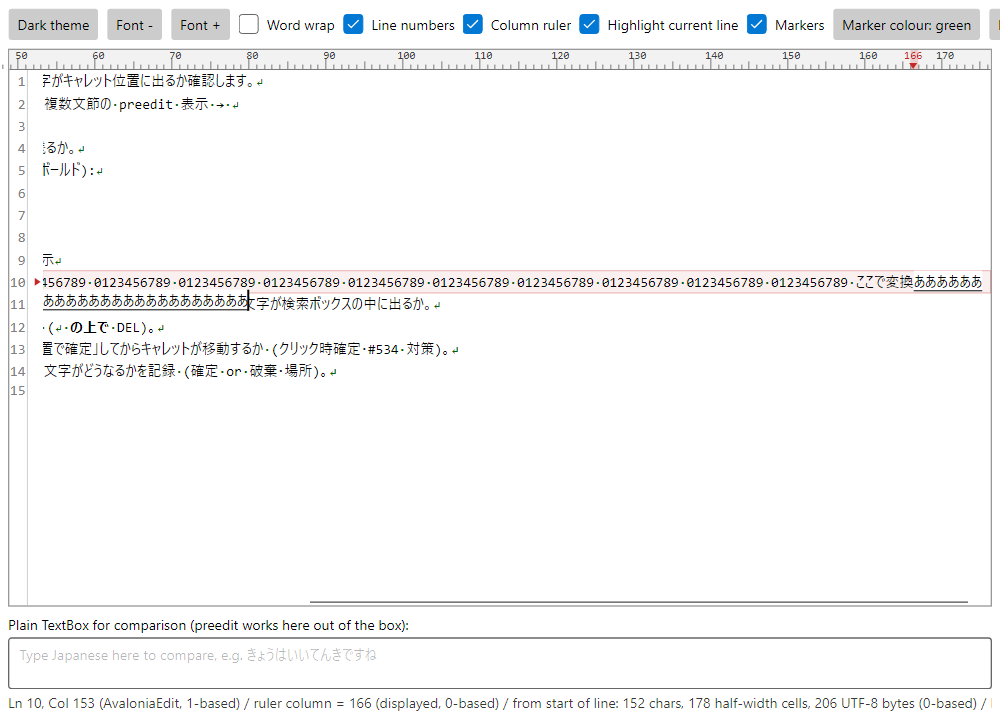
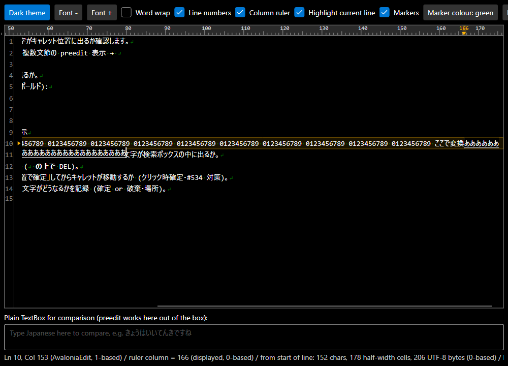

# AvaloniaEdit の IME 変換中文字（preedit）検証

[AvaloniaEdit](https://github.com/AvaloniaUI/AvaloniaEdit) で IME の変換中文字が表示されるかを確かめるための小さなアプリと、検証に使った fork 一式です。

英語版: [README.md](README.md)



## なぜ作ったか

AvaloniaEdit はエディタの中に IME の変換中文字を描きません（[#524](https://github.com/AvaloniaUI/AvaloniaEdit/issues/524)）。確定するまで画面に何も出ないため、日本語・中国語・韓国語の入力にはそのままでは使えません。Avalonia 標準の `TextBox` では同じ問題は起きません。

原因は狭くはっきりしています。Avalonia の Win32 IME 実装は `ShowCompositionWindow => false` で、OS 側は変換中の窓を出しません。変換中テキストがアプリへ渡る経路は `Client.SetPreeditText(...)` の 1 本だけで、これは `Client.SupportsPreedit` が false だと呼ばれません。AvaloniaEdit の `TextArea` は `public override bool SupportsPreedit => false;` と空の `SetPreeditText` を持っていたため、変換中テキストはそこで捨てられていました。この 2 つの外側でどう工夫しても直りません。

[PR #592](https://github.com/AvaloniaUI/AvaloniaEdit/pull/592)（作者 [@Timskt](https://github.com/Timskt) さん）は、まさにその 2 つを実装しています。`SupportsPreedit` を true にし、キャレット位置へ変換中文字を描く `PreeditLayer` を追加するものです。タイトルは中国語 IME を対象にしていますが、実装自体は言語に依存しません。本リポジトリを書いた時点でこの PR は未マージ、レビューコメントも 0 件でした。

ここに置いてあるのは、その PR を日本語 IME で 3 つの OS 上で実際に使ってみた結果です。

## 確認したこと

環境: .NET 10 ／ Avalonia 12.1.1 ／ AvaloniaEdit master `be976ea` ＋ PR #592 の preedit 部分。

| OS | IME |
|---|---|
| Windows 11 | Microsoft IME |
| macOS 26 | 日本語 - ローマ字入力（ライブ変換 ON / OFF の両方） |
| Linux Mint 22.3 Xfce | fcitx5 5.1.7 ＋ fcitx5-mozc 2.28.4715.102 |

### PR #592 だけで解決したこと

| # | 動作 |
|:-:|---|
| 1 | 変換中の文字がキャレット位置にインライン表示される（下線つき・変換中カーソルつき） |
| 2 | IME の候補ウィンドウが変換中文字の直下に追従する |
| 3 | 変換中の文字は本文（文書）に入らない。確定すると 1 回だけ入る |
| 4 | Escape で変換が取り消され、表示も消える |
| 5 | フォーカスを失ったとき・文書を差し替えたときに変換中表示が残らない |
| 6 | キャレットが動くと変換中表示もついていく |
| 7 | 複数文節・行の途中・横スクロール後・フォントサイズ変更・ライト/ダーク・折り返し ON/OFF・行番号 ON/OFF のいずれでも位置が崩れない |

3 は見た目ではなく数値で確かめました。58 文字の行の末尾で 9 文字を変換している最中、状態表示は `Ln 2, Col 59` のままでした。変換中文字が本文に入っていれば `Col 68` になるはずです。

### 日常的に日本語を打つには、さらに機能追加が必要だった

以下は PR #592 の欠陥ではありません。3 件はこの PR の対象外の動作で、2 件は日本語入力で起きる「長い変換」でだけ現れるものです。この PR を採用する人は同じ場面に出会うので、記録として残します。

| # | 起きること | 理由 | この fork での対応 |
|:-:|---|---|---|
| 1 | 変換中に別の場所をクリックすると、未確定の文字がキャレットについてくる | [#534](https://github.com/AvaloniaUI/AvaloniaEdit/issues/534)。Avalonia が IME をリセットするのは `ResetRequested` とクライアント切替の 2 場面だけで、キャレット移動では行いません。合成が続いたまま描画位置だけが移ります | クリックのトンネル段階（キャレットが動く前）に、元の位置で確定させる |
| 2 | 右端をはみ出した変換中文字が切れて読めない | 変換中文字は文書に入らないため、本文のような自動折り返しも自動横スクロールも効きません。1 行の `NoWrap` として描いていました | その下の行へ折り返して描く。下の本文が透けないよう先に背景を塗る |
| 3 | 長い行の末尾では、変換中文字を出す余地そのものが無い | 横スクロール範囲に upstream の 3px しか余白がありませんでした | 全角 5 文字ぶんの余白を、スクロール範囲と `BringCaretToView` の矩形の両方に足す |
| 4 | 長い変換を確定するとキャレットが画面外に残る | `PerformTextInput` はスクロール範囲が再計算される前に `BringCaretToView` を呼ぶので、古い上限で頭打ちになります | レイアウト更新後にもう一度キャレットを可視化する |
| 5 | 変換中の文字だけ数 px 上に表示される | 変換中文字は行の上端を基準に描かれ、本文は行内のベースラインを基準に描かれます。行にフォールバック書体が混ざると両者が食い違います | 変換中文字もキャレット行のベースラインを基準に描く |

4 の実測: 24 文字を確定したとき、横スクロール量は 384.4 → 386.9px で止まり、キャレットは X=1204.2（ビューポート幅 981.3）で画面外でした。確定後のスクロール範囲は 1670.6 に増えていました。5 の実測: 3px。



ダークテーマでも同じです（背景の塗りがテーマに追従します）:



### まだ解決していないこと

* **文節ごとの下線の描き分け。** 日本語 IME は注目している文節とそれ以外を区別して表示します。Avalonia の `SetPreeditText(string text, int? cursorOffset)` が渡してくるのは文字列とカーソル位置 1 つだけなので、変換中文字は全体が同じ下線で描かれます。
* **子コントロールによる IME クライアントの横取り。** `TextArea` のクラスハンドラが `TextInputMethodClientRequestedEvent` で `e.Client` を無条件に上書きします。このイベントはバブリングするため、`TextArea` の視覚的な子孫にある `TextBox`（組込み `SearchPanel` の検索ボックスなど）は自分のクライアントを奪われ、変換中文字はエディタの左上に、確定した文字だけが検索ボックスに入ります。
  これは preedit のパッチとは無関係で、以前から存在していた欠陥が `SupportsPreedit` を true にしたことで見えるようになったものです。同じ作者の [PR #591](https://github.com/AvaloniaUI/AvaloniaEdit/pull/591) がこれを直しています。本リポジトリのデモは検索パネルを Window の `OverlayLayer`（`TextArea` の外）に置くことで構造的に回避しており、`--diag` で実測できます:

  ```
  focus=PART_SearchBox -> client=TextBoxTextInputMethodClient rect=11, 7
  ```

## 構成

```
src/AvaloniaEdit/       AvaloniaEdit master be976ea + PR #592 の preedit + 上記 5 件
src/ImePreeditDemo/     デモアプリ
docs/                   スクリーンショット
run-demo.sh             ビルド → 自動計測 → 起動
```

`src/AvaloniaEdit/` のうち upstream から変わっているのは 4 ファイルだけです。追加した箇所にはすべて `TEXTSS-ADD` の目印が付いています:

```
Editing/TextArea.cs        PR #592 の preedit 配線 ＋ クリック時確定 ＋ 確定後のスクロール追従
Rendering/PreeditLayer.cs  PR #592 で追加されるファイル ＋ 右端の折り返し ＋ ベースライン合わせ
Rendering/TextView.cs      横スクロールの余白 ＋ 最終行より下の余白の制限
Editing/Caret.cs           BringCaretToView でキャレットの右に確保する余白
```

一覧を見るには:

```
grep -rn "TEXTSS-ADD" src/AvaloniaEdit/
```

## 動かし方

[.NET 10 SDK](https://dotnet.microsoft.com/download) が必要です。

```
dotnet run --project src/ImePreeditDemo
```

ビルド → 自動計測 → 起動 をまとめて行う場合:

```
bash run-demo.sh
```

エディタに日本語を入力して、変換中の文字がどう出るかを見てください。下にある標準の `TextBox` は比較用です。こちらは何もしなくても変換中文字が出るので、エディタが目指すべき見え方が分かります。エディタの検体テキストには確認項目が 9 つ並べてあります。

エディタはあえて [TextSS](https://textss.sakura.ne.jp/) と同じ設定にしてあります。改行・全角スペース・タブをマーカー文字で可視化する状態です。これらの問題が見つかったのがこの状況であり、マーカーと変換中文字が共存できることも確認したいためです。

### 計測用のオプション

いずれも通常起動の見た目は変えません。オプションを付けたときだけ動きます。

| オプション | 内容 |
|---|---|
| `--diag` | フォーカス移動に応じてどの `TextInputMethodClient` が採用されるかを出す |
| `--diag-preedit` | 横スクロールの余白を測り、IME 無しで変換中文字の描画経路を通して PNG を保存する。`--dark` でダークテーマ、`--commit` で確定まで通して追従スクロールも測る |
| `--diag-clickmarker` | 行末より右をクリックしたときの `SelectionMouseHandler` の処理を再現する |
| `--diag-dblclick` | ダブルクリックで改行マーカーだけが選択されないかを確かめる |
| `--diag-inputsource` | 実際のキー押下がどの経路に届くかを数える |
| `--diag-ruler` | 上辺の列ルーラーが本文とそろっているかを確かめる |

`--diag-preedit` が外部の画面キャプチャではなく自分で PNG を描いて保存するのは、別ウィンドウを活性化すると横スクロールが戻り、フォーカスが外れると変換中文字が消えるためです。どちらもプロセスの外からは避けられません。

## 関連

* Issue [#524](https://github.com/AvaloniaUI/AvaloniaEdit/issues/524) — Support IME Preedit
* Issue [#534](https://github.com/AvaloniaUI/AvaloniaEdit/issues/534) — Composition should be committed
* PR [#532](https://github.com/AvaloniaUI/AvaloniaEdit/pull/532) — Support PreeditText
* PR [#591](https://github.com/AvaloniaUI/AvaloniaEdit/pull/591) — Fix IME client incorrectly handling child control events
* PR [#592](https://github.com/AvaloniaUI/AvaloniaEdit/pull/592) — Support Chinese IME preedit and fix related bugs

経緯は TextSS の移植開発記に日本語で書いています:
<https://textss.sakura.ne.jp/devlog.html>

## ライセンス

デモアプリは MIT です（[LICENSE](LICENSE)）。

`src/AvaloniaEdit/` は AvaloniaEdit の fork で、AvaloniaEdit も MIT です。ライセンス本文は `src/AvaloniaEdit/LICENSE` にそのまま置いてあります。第三者ソフトウェアの表記は [THIRD-PARTY-NOTICES.md](THIRD-PARTY-NOTICES.md) にまとめています。
